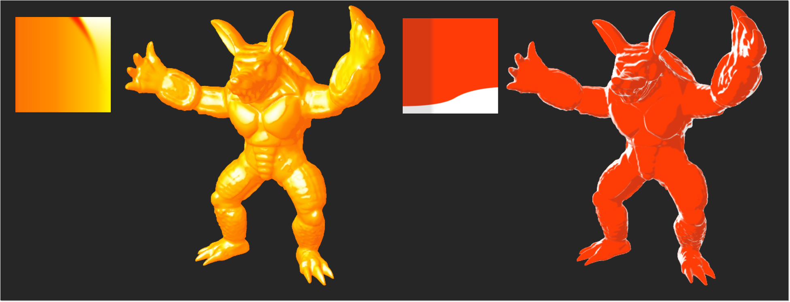
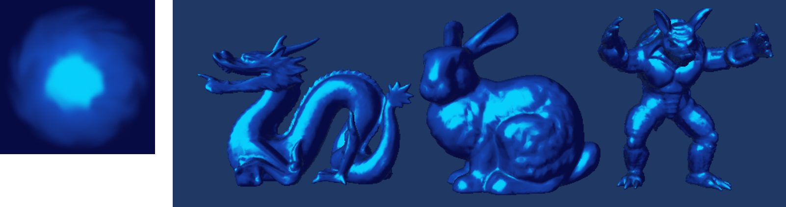

Maya CgFX Shaders
====

Simple NPR shader demo in Maya.
* X-Toon [Barla et al. 2006]
* Lit-Sphere [Sloan et al. 2001]

## Demo
### X-Toon

### Lit-Sphere

## Usage

Load CgFX shader file (in cgfx directory) with a built-in Maya CgFX shader.
You can test the shader with sample textures.
